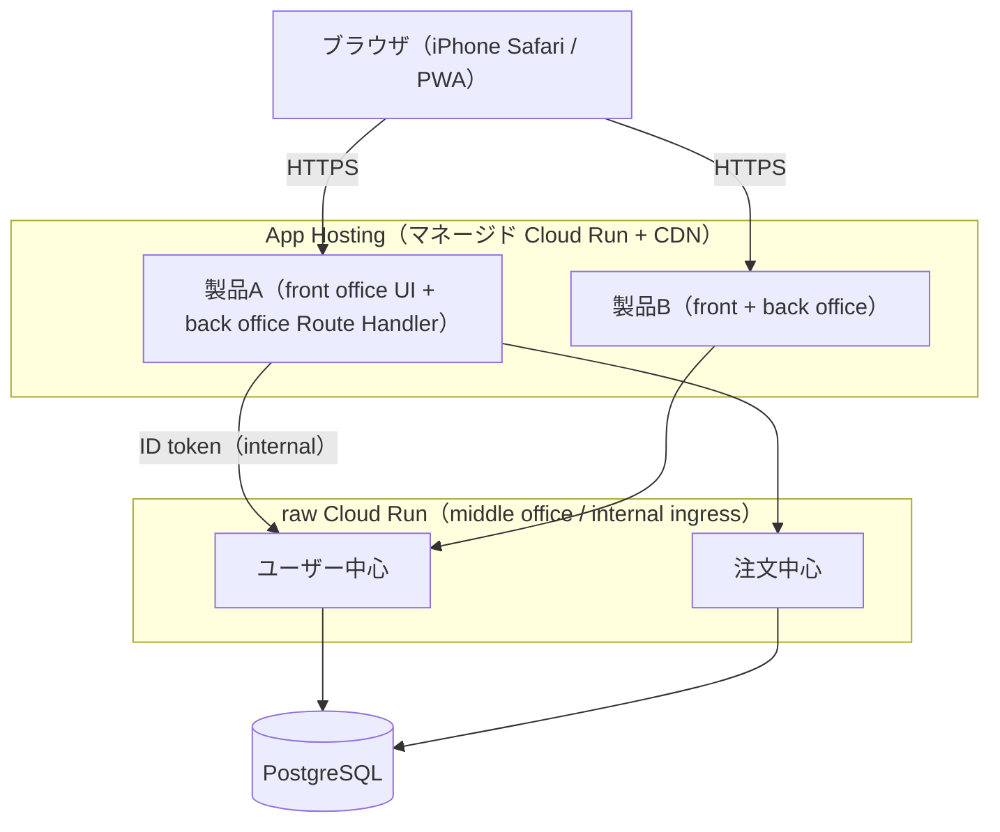
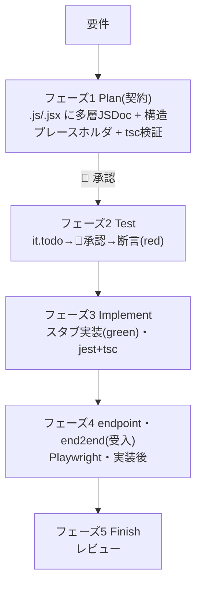
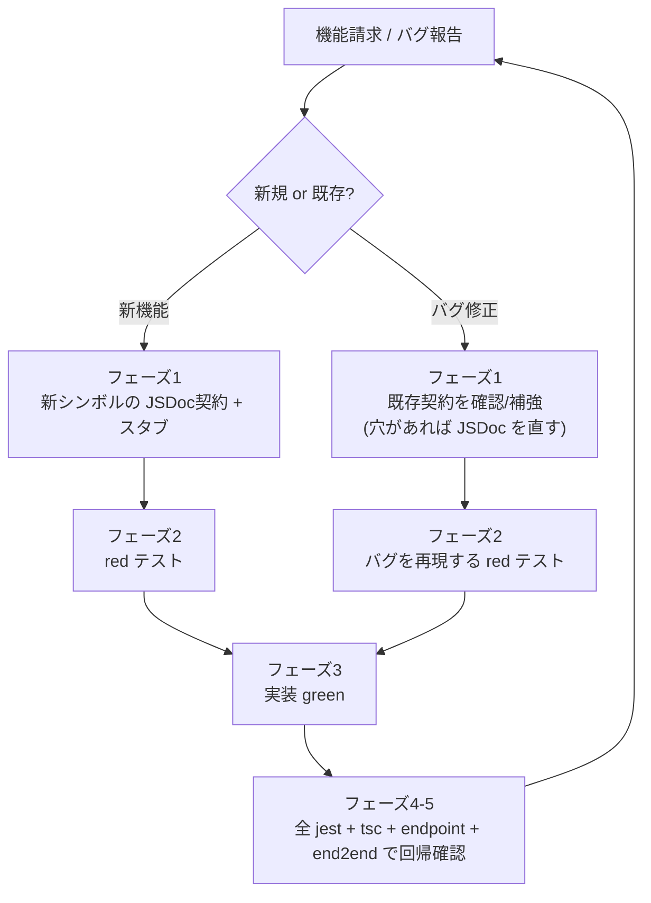
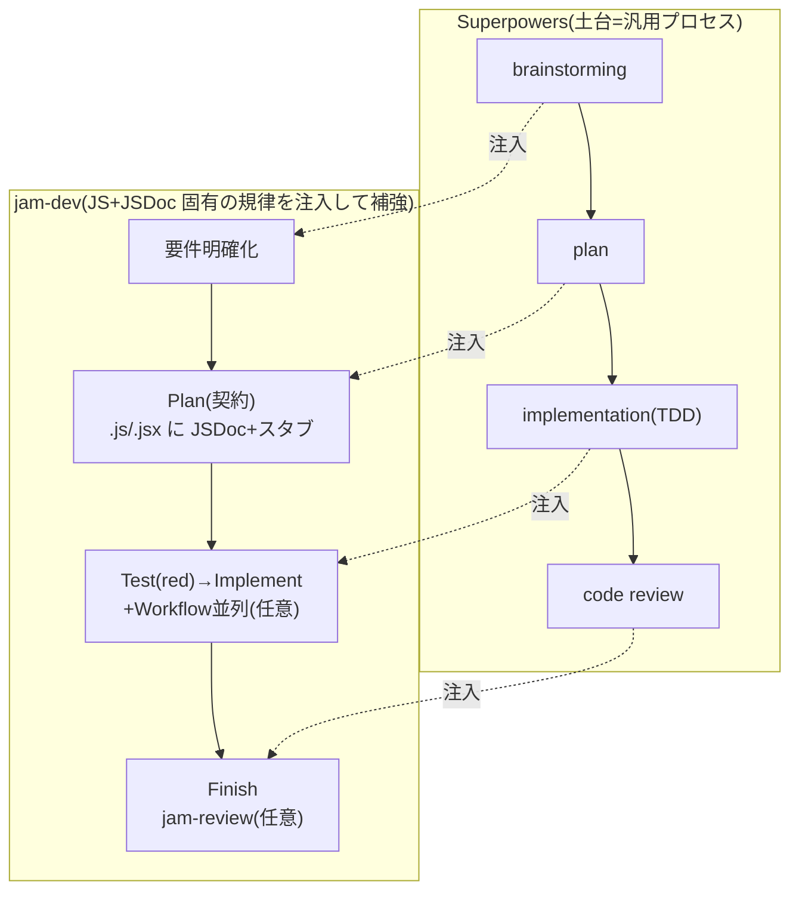
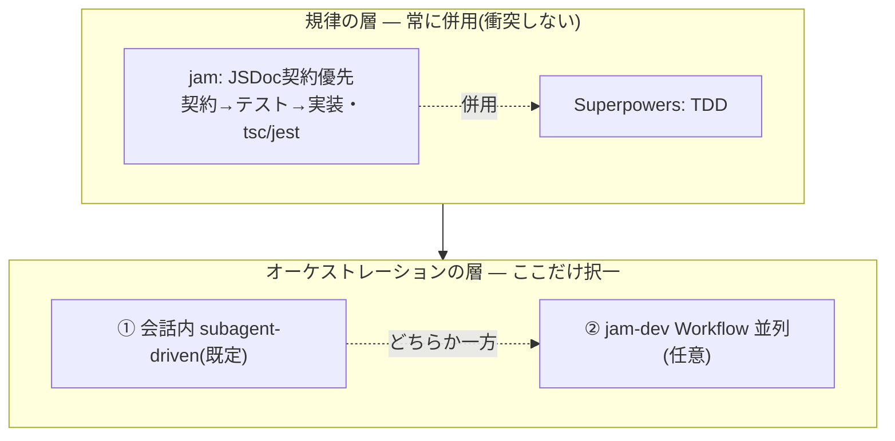
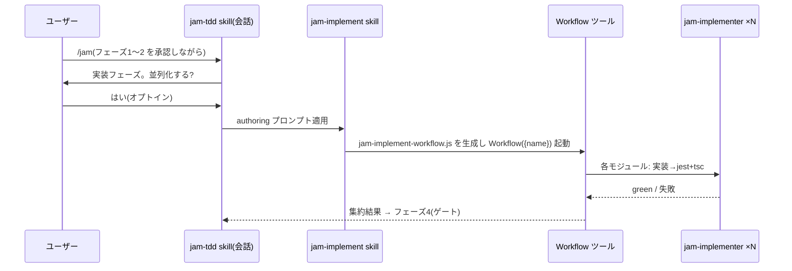
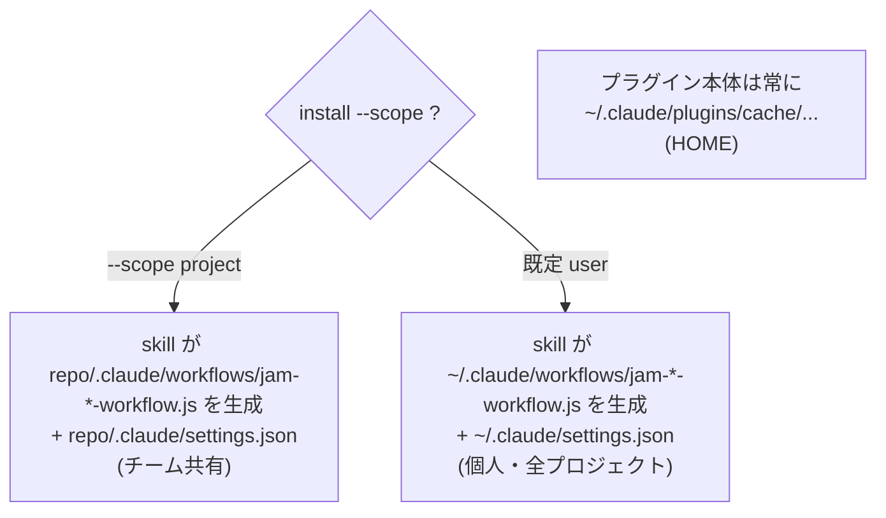

# jam-dev 仕様 — JSDoc 契約優先 + TDD 開発フロー

本仕様は、Claude Code プラグイン **jam-dev** が課す開発フローを規定する。jam-dev は Superpowers を補強し、Claude Code による **Next.js(App Router)** 開発において、実装より先に JSDoc で契約を確定させる。契約を起点に、**単体(ヘルパー・Server Action)は test-first(red → green)、endpoint・end2end(API・UI)は実装後の受入テスト**として検証し(§2.1)、各フェーズにヒューマンゲートを課す。機能追加・バグ修正は本フローを1サイクルとして反復し、各サイクルは回帰安全(§2.2)とする。本書は2部構成:第 I 部が方法論(§1–§4)、第 II 部が jam-dev プラグインの構築・配布(§5–§8)。

---

# 第 I 部 — 開発フロー(方法論)

## 1. 前提と原則

### 1.1 前提

| 項目 | 規定 |
|---|---|
| 言語・型 | JavaScript + JSDoc。型はすべて JSDoc(`@typedef` / `@param` / `@returns` 等)で記す。`.d.ts` は作らない。型検査は `tsc`(出力なし) |
| モジュール | ESM(`import` / `export`、`package.json` に `"type": "module"`) |
| 対象 | jam-dev を適用する Next.js リポジトリ。契約・検証は全コードに課す(コード種別ごとの手段は §3.6、構成・配置は §1.4) |
| ディレクトリ | Next.js `src/app` モード(`src/` 構成)。`src/helper/`(ヘルパー=純粋関数)/ `src/action/`(Server Action・使う場合)/ `src/component/`(コンポーネント)/ `src/type/`(共有 `@typedef`・JS+JSDoc)/ `src/app/`(page・layout・`api/**/route.js`)でモジュール化する。テストは §3.4 |
| テスト | 単体 = Jest、endpoint・end2end = Playwright |
| 文書 | Markdown + Mermaid |
| 依存 | Superpowers に依存(同梱しない)。`plugin.json` の `dependencies` で宣言する(§8) |

> 補足: 横断的な型は `src/type/` に JS+JSDoc の `@typedef` で集約する(モジュール固有型はそのファイル内でよい)。Server Action は **`'use server'` を持つ関数/ファイル**で、`src/action/` に集約する(`src/action/` には Server Action 以外の通常モジュールを置かない)。

### 1.2 設計原則

1. **契約優先** — 実装より先に JSDoc 契約を確定する。
2. **多層・詳細な JSDoc** — module / class / function / method / component props / `@typedef` の各層に `@param` / `@returns` / `@throws` と意図を記す。実装はこの契約に収束させる。
3. **Plan は実ファイルを直接生成する** — 別の manifest を持たない。フェーズ1で対象 `.js / .jsx`(ヘルパー等の `.js` とコンポーネントの `.jsx`)に契約と構造プレースホルダを直接記す。位置はファイル内順序(§3.1)で定め、行番号に依存しない。
4. **粒度はモジュール単位** — 契約・テスト・実装はモジュール(`.js / .jsx`)単位でまとめて行い、関数単位で刻まない。
5. **進捗は実ファイルに現れる** — 未実装は `throw` スタブで表す。進捗を別ファイルで二重管理しない。
6. **ヒューマンゲート** — 前フェーズが承認されるまで次へ進まない。
7. **Superpowers を補強する** — できることは再実装せず直接使う(§4)。

### 1.3 用語

- **契約** — JSDoc による型(`@param` / `@returns` / `@typedef` 等)と一行の意図(振る舞い)。module / class / function / component props の各層に記す。
- **スタブ** — 契約のみを持ち、本体が `throw new Error('not implemented')` の宣言。
- **規律** — jam が課す JS+JSDoc 固有の規則(契約優先・`tsc`/`jest` 検証・配置規約)。
- **回帰安全** — サイクルの完了条件「全テスト + 型検査が緑」により、以前緑だった挙動が壊れない性質(§2.2)。
- **ヘルパー** — UI / Route Handler から抽出した純粋関数(framework 非依存・決定的)。`src/helper/` に置き、Jest 単体でテストする。
- **Route Handler(BFF)** — `src/app/api/**/route.js`。共通サービスを呼ぶ薄い API 境界。endpoint で検証する。
- **Server Action** — `'use server'` を持つ関数。React のフォーム/クライアントから呼ぶ **UI のミューテーション手段**で、**UI を持つアプリにのみ存在する**(使うかは任意。既定の変更系統は Route Handler)。`src/action/` に集約し、関数として Jest(共通サービスの HTTP は MSW で mock)で検証する(純粋部はヘルパーへ抽出)。
- **共通サービス(middle office)** — 複数の製品(front office)から再利用される共有業務能力層。Next.js API 専用のマイクロサービス群を1つの別リポ(npm workspaces モノレポ)に集約する(構成・配置は §1.4)。製品の Route Handler(back office)経由で呼ぶ。本リポからはテストで差し替える(MSW / stub)。jam-dev は当該モノレポにも同様に適用する。
- **endpoint** — Route Handler(API)を Playwright `request` で検証するテスト(ブラウザ無し・共通サービスは dev サーバで stub)。配置は §3.4。
- **end2end** — UI / ブラウザフローを Playwright で検証するテスト。配置は §3.4。
- **red / green** — テストが失敗 / 成功する状態(TDD)。
- **断言(assertion)** — 期待結果を検証する文(`expect(...)` 等)。
- **駆動役** — 実装を進める主体。会話内 subagent または jam-dev の Workflow(§4.1)。
- **Workflow** — Claude Code の本体機能。JS スクリプトで subagent を並列/逐次実行する。jam-dev の `jam-<機能>-workflow.js` はこの Workflow スクリプト(§5)。

### 1.4 対象プロジェクトのデプロイ構成

jam-dev は Next.js リポジトリ単位で適用する。対象は役割により front office / back office / middle office の3層に分かれ、2種類の配置先へデプロイする。本節はその構成・配置先・手順を自己完結で規定する(プラットフォームの最終挙動は Google Cloud / Firebase 公式文書を正とする)。

#### 層の定義

- **front office** — 社内の個別 Next.js プロジェクト(ユーザー向け製品)の UI(`src/app` の page / layout、`src/component`)。
- **back office** — 同じ製品内部の Route Handler(`src/app/api/**/route.js`・endpoint)。サーバ側 API 境界(BFF)として middle office を呼ぶ。
- **middle office** — 複数の製品から再利用される共有サービス(共通サービス)。Next.js API 専用のマイクロサービス群を1つの別リポ(npm workspaces モノレポ)に集約する。

front office と back office は同一 Next.js アプリの2層であり、合一して1製品 = 1デプロイ単位とする(任意で Server Action を含む)。middle office は製品から独立した別リポとする。

#### 配置(どこに)

| 層 | jam-dev 形状 | デプロイ単位 | デプロイ先 | ingress |
|---|---|---|---|---|
| **front office + back office**(製品) | UI アプリ(BFF) | アプリ1つ | App Hosting | 公開 + CDN |
| **middle office**(共通サービス) | API 専用サービス | モノレポ内の各マイクロサービス | raw Cloud Run | internal |

ブラウザは front office のみと通信し、middle office へは back office(Route Handler)がサーバ間で代理する。middle office は外部に公開しない。



製品は複数存在し、いずれも共有の middle office を再利用する。製品を1つ追加するごとに App Hosting のバックエンドを1つ増やし、middle office は据え置く。

#### middle office のリポ構成(モノレポ)

middle office はマイクロサービス群を1つの別リポに集約する。root の `package.json` が各マイクロサービス(top-level サブフォルダ)を workspaces で参照し、`node_modules` は主に root に hoist する。npm コマンドは原則 root で実行し(root スクリプトが各サービスへ fan-out)、各マイクロサービスフォルダは自分の `package.json`(自分の依存のみ)を持つ。各サービス内部は §1.1 のディレクトリ規約に従う(API 専用のため UI / Server Action は持たない)。

```
middle-office/                     # 共通サービスモノレポ（front office とは別リポ）
├─ package.json                    # "workspaces": ["user-center","order-center","image-recognition"]
├─ package-lock.json
├─ node_modules/                   # hoisted（主に root）
├─ user-center/                    # マイクロサービス（Next.js API 専用）
│  ├─ package.json                 # 自分の依存のみ
│  ├─ next.config.js               # output: 'standalone'
│  ├─ jsconfig.json
│  └─ src/
│     ├─ helper/                   # 純粋関数（Jest）
│     ├─ type/                     # 共有 @typedef
│     ├─ app/api/**/route.js       # Route Handler（endpoint）
│     └─ endpoint/                 # endpoint テスト
├─ order-center/
│  └─ …（同構成）
└─ image-recognition/
   └─ …
```

各マイクロサービスは独立した Next.js API としてビルドし、それぞれを raw Cloud Run の個別サービスへデプロイする。

#### デプロイの手順と流れ(どのように)

**前提** — Google アカウントに課金を紐付ける。GCP プロジェクトと Firebase プロジェクトを 1:1 で対応させ、全リソースを同一プロジェクトに集約する。App Hosting は Blaze プランを要する。

**製品(front office + back office)→ App Hosting**

1. Firebase プロジェクトを用意し Blaze にする。`firebase-tools` を導入してログインする。
2. App Hosting で GitHub リポジトリ・ブランチ(例 `main`)・ルートを接続し、バックエンドを作成する。以後は `git push` で Cloud Build → buildpacks によるコンテナ化 → Cloud Run へのデプロイ → CDN 配信 が自動実行される。
3. ローカルから直接デプロイする場合は `firebase init apphosting` → `firebase deploy` を用いる。
4. 実行時設定は `apphosting.yaml` の `runConfig` に置く。Cloud Run コンソールでの直接変更は rollout で上書きされるため行わない。

**middle office(共通サービス)→ raw Cloud Run**

1. マイクロサービスごとに `gcloud run deploy <service> --source <service-dir> --region <region> --ingress internal --no-allow-unauthenticated` でデプロイする(buildpacks が Next.js を認識するため Dockerfile は不要)。
2. 各サービスの `next.config` は `output: 'standalone'` とし、API 専用(pages/SSR を持たない)に絞って軽量化する。
3. 多コンテナ(sidecar)が要る場合は `service.yaml` を用い `gcloud run services replace service.yaml --region <region>` で適用する。App Hosting は sidecar 非対応のため、sidecar が要る層は必ず raw Cloud Run とする。

#### 設定・認証

- **設定ファイル規約** — `apphosting.yaml` / `service.yaml` は拡張子(`.yml` / `.yaml`)を保ちつつ中身を JSON 構文で記す(YAML は JSON のスーパーセット)。JSON はコメント不可のため、説明は文書・コード側に置く。
- **サービス間認証(IAM)** — jam-dev で middle office(共通サービス)を扱う際、その ingress を internal とし、back office(Route Handler)からの呼び出しはサービスアカウント + ID token(IAM)で認証する(Cloud Run ネイティブの service-to-service)。ブラウザから middle office へは直結しない。

> テストとの対応: この internal な middle office 境界が §3.6 の「Route Handler が共通サービスを呼ぶ箇所はテストで差し替える」に当たる(endpoint は env で stub、Server Action は MSW)。

---

## 2. 開発フロー(5フェーズ)

実 `.js / .jsx` に契約を先に記し、テストと実装をそこへ収束させる。順序を飛ばさない。



| フェーズ | 作業 | ゲート |
|---|---|---|
| **1 Plan(契約)** | 対象 `.js / .jsx`(ヘルパー等の `.js` とコンポーネントの `.jsx`)を作成し、多層 JSDoc(module / class / function / method / component props / `@typedef`)と構造プレースホルダ(本体は `throw new Error('not implemented')`)を直接記入する。`tsc -p jsconfig.json --noEmit` で型契約を検証する | 🚧 承認 |
| **2 Test(red)** | JSDoc 契約に対し Jest を記述する。`it.todo` で検証項目を列挙 → 🚧承認 → 断言を埋めて **red** にする(§3.3) | 🚧 承認(it.todo) |
| **3 Implement(green)** | スタブ本体をモジュール単位で実装し、`jest` と `tsc` を緑にする(並列加速は §5) | — |
| **4 受入(endpoint・end2end)** | Playwright で endpoint と end2end を**受入テスト**として追加する(実装後・Next.js dev サーバ〔共通サービスは env で stub〕に対して実行)。全 Route Handler に endpoint、UI を持つリポでは全ルート(page/layout)に end2end を課す | — |
| **5 Finish** | レビューし、未実装スタブが残っていないことを確認する | — |

### 2.1 契約の検証

契約は3系統で検証する:型(`tsc`)・振る舞い(Jest:ヘルパー・Server Action)・外部受入(endpoint・end2end)。フェーズ2の Jest は型ではなく振る舞いを検証する。

| 契約 | 中身 | 検証手段 | タイミング |
|---|---|---|---|
| **型の契約** | JSDoc シグネチャ(`@param` / `@returns` / `@typedef`) | `tsc -p jsconfig.json --noEmit` | フェーズ1 直後から常時(静的) |
| **振る舞いの契約** | 意図(関数 / メソッドが何をするか) | Jest | フェーズ2で **red**、フェーズ3で **green** |
| **外部受入** | API / UI の外形的振る舞い | endpoint・end2end(Playwright) | フェーズ4(実装後の受入) |

- Jest はヘルパーを import し、契約の `@param` 型に沿う入力(型付き fixtures)で呼び `@returns` と意図を assert する。Server Action は共通サービスへの HTTP を MSW で mock して呼び、結果を assert する(§3.6)。
- 実装前はスタブが `throw` するため red、実装後 green とする。
- テストは契約のインターフェースに対して記し、実装は契約を満たす。
- **test-first は Jest(ヘルパー・Server Action)に限る**(endpoint・end2end は実装後の受入)。型契約(`tsc`)は全コードで常時。

### 2.2 反復サイクル(機能追加・バグ修正)

機能請求・バグ修正ごとにフロー全体を1サイクル回す。サイクルの完了条件は「全テスト + 型検査が緑」とし、以前緑だった挙動を壊さない(回帰安全)。



- **新機能** — 新シンボルの契約 → red → green → 回帰確認。
- **バグ修正** — 既存契約を確認し(不足なら JSDoc を補強)、バグを再現する red を加え、修正して green、回帰確認。
- テストは破棄せず回帰スイートとして蓄積し、毎サイクル全実行する。
- 回帰安全は次で担保する:
  - 完了前に全 `jest` + `tsc -p jsconfig.json`(単一 program)+ endpoint + end2end を緑にする(`Stop` フックが自動確認。§6)。型は `tsc`、振る舞いは Jest、endpoint・end2end は Playwright が守る。
  - 修正したバグは red→green テストとして恒久化し、再発を防ぐ。

---

## 3. 規約

### 3.1 ファイル内の標準順序

```
1. // @ts-check
2. import
3. @typedef
4. export 関数 / class(依存順 / 宣言順)
5. 非公開 helper(末尾、または最初の使用箇所の直下)
```

`.jsx` も同順序とする(コンポーネントは props 型付き JSDoc を持つ export 関数として `4.` に置く)。`5.` の非公開 helper は本番コードであり、テストではない。テストは別ファイルに置く(§3.4)。

**説明は JSDoc(`/** ... */`)のみで記し、必ず対象コードの直上の行に置く(同行末尾には書かない)。** コードの挙動を説明する行内コメント(`//`)は書かない。例外は機械的ディレクティブ(`// @ts-check`・`'use server'` / `'use client'`)のみ。

### 3.2 契約の記述(フェーズ1 の出力)

実 `.js / .jsx` に ESM で契約とスタブを直接記す(ヘルパー等は `.js`、React コンポーネントは `.jsx`。コンポーネントは props を JSDoc で型付け、§3.6)。各 `@param` / `@returns` / `@throws` と意図を記し、スタブ本体は `throw new Error('not implemented')` とする。

```js
// @ts-check

/**
 * 注文の金額計算・検証ヘルパー(純粋関数)。
 * @module helper/order
 */

/**
 * @typedef {object} OrderItem
 * @property {string} sku - 商品コード
 * @property {number} qty - 数量(>=1)
 */

/**
 * @typedef {object} Order
 * @property {string} id
 * @property {OrderItem[]} items
 * @property {number} total - 合計金額(税込)
 * @property {'pending'|'paid'|'cancelled'} status
 */

/**
 * 明細から新規注文を組み立てる(純粋。永続化はしない)。
 * @param {OrderItem[]} items - 1件以上の明細
 * @returns {Order} status='pending' の新規注文
 * @throws {RangeError} items が空のとき
 */
export function buildOrder(items) {
  throw new Error('not implemented');
}

/**
 * 明細を保持し合計を計算する純粋な集約(I/O を持たない)。
 */
export class Cart {
  /**
   * @param {OrderItem[]} items
   */
  constructor(items) {
    throw new Error('not implemented');
  }

  /**
   * 合計金額(税込)を返す。
   * @returns {number}
   */
  total() {
    throw new Error('not implemented');
  }
}

/**
 * 明細が妥当か判定する(内部 helper・純粋。テストではない)。
 * @param {OrderItem[]} items
 * @returns {void}
 */
function validateItems(items) {
  throw new Error('not implemented');
}
```

### 3.3 テストの記述(フェーズ2)

1. **検証項目を `it.todo` で先に列挙する。** 承認後に断言を埋める。`it.todo('説明')` は本体のない予定テストで、Jest が `todo` として保留表示する(`it` = `test` = 1テストケース)。
2. **型は再利用される値にのみ付ける。** fixtures / factories / mocks / helpers に JSDoc 型を付け、`it(...)` のコールバック本体には付けない。
3. **テスト構造は source の鏡写しとする。** 1公開関数 = 1 `describe`、1振る舞い = 1 `it`。カバレッジが契約と 1:1 対応する。

用語: **fixture** = 固定サンプルデータ / **factory** = テストデータ生成関数 / **mock** = 依存の代替 / **helper** = 複数テスト共通の関数。

```js
describe('buildOrder', () => {
  it.todo('明細から注文を構築し status は pending');
  it.todo('items が空なら RangeError を投げる');
});
```

```js
// @ts-check
import { describe, it, expect } from '@jest/globals';
import { buildOrder } from './order.js';

/**
 * OrderItem を生成する factory(再利用されるので型を付ける)。
 * @param {Partial<import('./order.js').OrderItem>} [overrides]
 * @returns {import('./order.js').OrderItem}
 */
const makeItem = (overrides = {}) => ({ sku: 'A1', qty: 1, ...overrides });

describe('buildOrder', () => {
  it('明細から注文を構築し status は pending', () => {
    const order = buildOrder([makeItem()]);
    expect(order.status).toBe('pending');
  });
  it('items が空なら RangeError を投げる', () => {
    expect(() => buildOrder([])).toThrow(RangeError);
  });
});
```

### 3.4 テストの配置

テストは業務ファイルに記さず、常に別ファイルとする。テスト層は3つとする:

- **単体(Jest)** — 実装ファイルの隣に `<name>.test.js` を置く(ヘルパー `src/helper/order.js` ↔ `src/helper/order.test.js`、Server Action `src/action/checkout.js` ↔ `src/action/checkout.test.js`)。コンポーネント(`.jsx`)は単体テストを持たず、振る舞いは end2end で検証する(§3.6)。
- **endpoint(Playwright)** — `src/endpoint/` に置く(定義は §1.3)。
- **end2end(Playwright)** — `src/end2end/` に置く(定義は §1.3)。

```
src/type/order.js               # 共有型(@typedef)— JS+JSDoc
src/helper/order.js             # ヘルパー(純粋関数)
src/helper/order.test.js        # Jest 単体 — 隣に置く
src/action/checkout.js          # Server Action('use server'。純粋部は src/helper/ ヘルパーへ抽出)
src/action/checkout.test.js     # Jest(関数・共通サービスの HTTP を MSW で mock)
src/app/api/orders/route.js     # API(Route Handler・BFF)
src/app/checkout/page.jsx       # page / コンポーネント(.jsx)— 単体テストなし(§3.6)
src/endpoint/orders.spec.js     # endpoint(Route を request で検証・ブラウザ不要)
src/end2end/checkout.spec.js    # end2end(ブラウザフロー)
```

根拠: 業務ファイルにテストを混在させると本番バンドルへ混入し、`tsc` / レビュー / カバレッジ計測が煩雑になる。別ファイルなら「`tsc` の対象 / Jest の対象 / 本番バンドル」を切り分けられる。

注: `.test`(Jest)・`.spec`(Playwright)は各ランナーの既定検出マッチャであり(spec = BDD 由来の「仕様」)、慣習に従う。

### 3.5 型チェック

型検査は **単一の `jsconfig.json`** で行う。各 `.js / .jsx` 先頭に `// @ts-check` を置き、`src/` 全体(helper / app / endpoint / end2end / component)を1つの program で検査する。

- `jsconfig.json` に `allowJs` + `checkJs` + `noEmit` + `jsx`(Next.js が設定)+ **`types: ["node"]`** を設定する(Next.js 生成の `jsconfig.json` に `checkJs` / `types` を足す)。検証は `tsc -p jsconfig.json --noEmit`(`tsc` は `jsconfig.json` を自動で読まないため `-p` 必須)。
- **テスト型は import 由来に統一する** — Jest は `@jest/globals`、Playwright は `@playwright/test` から `test` / `expect` を import する(§3.3)。グローバル `types` に jest と playwright を同居させると両者が `expect` / `test` を拡張して衝突するため、グローバル注入をやめ import 由来の型に揃える。

型は JSDoc に書くので `.d.ts` は作らない。開発依存は `typescript` / `@types/node` / `@playwright/test` / `msw`(共通サービスの HTTP mock)(JSX 型検査には `@types/react`)。`@types/jest` は使わない(`@jest/globals` が型を同梱する)。

### 3.6 コード種別ごとのテスト

契約優先は全コードに適用する。型契約(JSDoc)は `tsc` が全コードで検査する。振る舞いテストは種別ごとに対応する:**ヘルパーと Server Action は Jest、API(Route Handler)は endpoint、UI(コンポーネント・page・layout)は end2end**(endpoint・end2end は Playwright)。**test-first は Jest(ヘルパー・Server Action)に限り、endpoint・end2end は実装後の受入テストとする**(§2.1)。**UI を持つリポでは全 page / layout を例外なく end2end の対象とする**(各ルート(page)に end2end を課し、layout は配下ルート経由で必ず検証する。API 専用リポは UI が無く endpoint と Jest のみ)。RTL / jsdom によるコンポーネント単体テストは**使わない**(end2end と重複し、async Server Component の制約も避けられる)。

| コード種別 | 型契約 | 振る舞いテスト |
|---|---|---|
| ヘルパー(純粋関数。`src/helper/`) | JSDoc(`@param` / `@returns` / `@typedef`)→ `tsc` | **Jest 単体**(戻り値・例外を assert) |
| Server Action(`src/action/`・使う場合) | JSDoc → `tsc` | **Jest 単体**(関数として直接 import・共通サービスの HTTP を MSW で mock)。純粋部は `src/helper/` ヘルパーへ抽出 |
| Route Handler(API・BFF。`src/app/api/`) | JSDoc → `tsc` | **endpoint**(Playwright `request`・共通サービスを env で stub した dev サーバ・ブラウザ無し) |
| React コンポーネント / page / layout(UI) | props を JSDoc で型付け → `tsc` | **end2end**(Playwright・ブラウザ) |

- Route Handler・Server Action・コンポーネントは薄く保ち、決定的な判断・計算(framework API〔`cookies()`・`revalidatePath()` 等〕や I/O を含まない処理)は `src/helper/` のヘルパーへ抽出して Jest 単体で固める。Route Handler は共通サービスを呼ぶ薄い BFF 境界とし、UI 層はコンポジションと表示に限る。
- endpoint は dev サーバに対して実行するため in-process mock は使えない。共通サービスを env で stub 実装に向けた dev サーバを起動し、Route Handler の入出力・経路を検証する(Server Action〔Jest〕は MSW で HTTP を mock。別手段)。
- コンポーネントのスタブも props を JSDoc で型付けし、本体は `throw` とする。

```jsx
// @ts-check
/**
 * @param {{ order: import('@/type/order').Order, onCancel: () => void }} props
 */
export function OrderCard({ order, onCancel }) {
  throw new Error('not implemented');
}
```

- UI 用の追加テスト依存は不要とする。型のため `@types/react` と `jsconfig.json` の `jsx`(Next.js が設定)を要する。

Server Action(使う場合)は `src/action/checkout.js` のように薄い関数として書き、純粋部はヘルパーへ出す。**UI から呼ばれる手段**である:例えば checkout ページの `<form action={checkout}>` が `checkout()` を呼ぶ。フォーム(UI)が無ければ呼び出し元が無いので、Server Action は UI を持つアプリにのみ存在する(画面の無い共通サービスは `/api/...` の Route Handler で公開する)。共通サービスは `fetch` で直接呼び、テスト(`src/action/checkout.test.js`)は end2end ではなく**関数として Jest** で行い、共通サービスへの HTTP を **MSW** で mock する。

```js
// @ts-check
'use server';

/**
 * 確定した注文を共通サービスへ送る。
 * @param {import('@/type/order').OrderItem[]} items
 * @returns {Promise<{ id: string }>}
 */
export async function checkout(items) {
  throw new Error('not implemented');
}
```

```js
// @ts-check
import { describe, it, expect, beforeAll, afterAll } from '@jest/globals';
import { setupServer } from 'msw/node';
import { http, HttpResponse } from 'msw';
import { checkout } from './checkout.js';

const server = setupServer(
  http.post('https://order.internal/orders', () => HttpResponse.json({ id: 'o1' })),
);
beforeAll(() => server.listen());
afterAll(() => server.close());

describe('checkout', () => {
  it('注文を共通サービスへ送り id を返す', async () => {
    expect((await checkout([{ sku: 'A1', qty: 1 }])).id).toBe('o1');
  });
});
```

---

## 4. Superpowers との関係

jam-dev は Superpowers を置き換えず補強する。汎用プロセスの各フェーズに、JS+JSDoc 固有の規律(JSDoc 契約・`tsc`/`jest` 検証・並列実装)を注入する。



| Superpowers のフェーズ | 方針 |
|---|---|
| brainstorming | Superpowers を直接使う |
| plan | 補強。Plan で実 `.js / .jsx` に JSDoc 契約を直接書く |
| subagent-driven implementation | フェーズ1–3 に規律を注入(§4.1) |
| code review | Superpowers を直接使う。JS+JSDoc 特化が要れば `jam-reviewer` で補強 |

契約スタブはインターフェースであり実装本体ではない(本体は `throw` のみ)。単体テストは実装より前に書くため(endpoint・end2end は実装後の受入テスト。§2.1)、Superpowers の「テスト先行」原則と両立する。

### 4.1 規律は常時併用・実装の駆動役のみ択一



- 規律(JSDoc 契約優先 + Superpowers TDD)は常に併用する。jam の核心「コード前に JSDoc 契約を確定」はどの実装方法でも適用する。
- 択一なのは実装の駆動役だけとする:① 会話内 subagent-driven(既定)、② jam-dev Workflow 並列(§5、任意)。
- 同じモジュール群に対し ① と ② を同時に走らせてはならない。

---

# 第 II 部 — プラグイン実装

## 5. Workflow 統合(実装フェーズの並列加速)

jam-dev は、人間ゲートを挟まない実行フェーズ(3 実装 / 4 受入 / 5 レビュー)を並列化する Workflow を3つ定義する。Workflow は Claude Code 本体機能で走行中は人間入力を受け付けないため、1 Workflow = 1フェーズとし、ヒューマンゲートは会話側(skill)が維持する。

| Workflow ファイル | フェーズ | 並列単位 |
|---|---|---|
| `jam-implement-workflow.js` | 3 実装 | red 済み独立モジュールごとに実装 → jest+tsc |
| `jam-acceptance-workflow.js` | 4 受入 | Route Handler ごとに endpoint、ルートごとに end2end |
| `jam-review-workflow.js` | 5 レビュー | ファイル / 観点ごとにレビュー |



- **雛形は同梱しない。** 各 Workflow は専用スキル(`jam-implement` / `jam-acceptance` / `jam-review`)が持つ authoring プロンプトに従い、オプトイン時に `.claude/workflows/jam-<機能>-workflow.js` を生成して `Workflow({ name })` で起動する(`workflow` はプラグイン部品でないため、部品である skill が生成を担う。配置スコープは §7)。
- **対象** — 独立モジュール(互いに import 依存が無く並列実装で衝突しないもの)が3つ以上、かつユーザー同意時。`args` は未実装スタブを含む `.js / .jsx`(`{ file, testFile }` の配列)から導く。
- **subagent** — `agentType: 'jam-implementer'`(実装・受入テスト生成)、`jam-reviewer`(レビュー)を使い、内部でも JSDoc / `tsc` / `jest` の規律を適用する。

```js
export const meta = {
  name: 'jam-implement-workflow',
  description: 'red 済みモジュールを並列実装し jest+tsc が緑になるまで検証',
  phases: [{ title: 'Implement' }, { title: 'Verify' }],
}
const out = await pipeline(args,
  m => agent(`${m.file} のスタブ本体を実装し ${m.testFile} を green に。ESM・throw を残さない。`,
             { agentType: 'jam-implementer', label: `impl:${m.file}`, phase: 'Implement' }),
  (_, m) => agent(`${m.file} を検証: jest と tsc -p jsconfig.json --noEmit。失敗なら原因を返す。`,
             { label: `verify:${m.file}`, phase: 'Verify', schema: VERDICT }))
return { results: out.filter(Boolean) }
```

---

## 6. プラグイン構成

```
jam-dev/                               # GitHub: gracia-popo/jam-dev で配布
├── .claude-plugin/
│   ├── plugin.json                    # name: jam-dev / 依存: superpowers
│   └── marketplace.json               # name: jam-marketplace / source "./"
├── skills/
│   ├── jam-tdd/                       # 中核(5フェーズ・ゲート・規約・記入例)
│   ├── jam-implement/                 # F3 並列実装 Workflow の authoring プロンプト
│   ├── jam-acceptance/                # F4 並列受入 Workflow の authoring プロンプト
│   └── jam-review/                    # F5 並列レビュー Workflow の authoring プロンプト
├── agents/
│   ├── jam-implementer.md             # 実装・受入テスト生成担当
│   └── jam-reviewer.md                # レビュー担当
├── hooks/
│   ├── hooks.json                     # Stop(検証)
│   └── validate.sh                    # 設定があれば tsc(jsconfig)+ jest
├── commands/
│   └── jam.md                         # /jam(起動)
└── README.md
```

skill を中核とし、subagent / hook / command を同梱する。`workflow` はプラグインのコンポーネント定義に存在しないため雛形は同梱せず、各 `jam-<機能>` skill が必要時に `.claude/workflows/jam-<機能>-workflow.js` を生成して実体化する(§5)。

---

## 7. 命名・配置・配布

| 対象 | 名前 |
|---|---|
| プラグイン / 中核 skill / マーケットプレイス | `jam-dev` / `jam-tdd` / `jam-marketplace` |
| Workflow skill(authoring) | `jam-implement` / `jam-acceptance` / `jam-review` |
| 生成される Workflow | `jam-implement-workflow.js` / `jam-acceptance-workflow.js` / `jam-review-workflow.js`(`.claude/workflows/`) |
| subagent | `jam-implementer` / `jam-reviewer` |
| コマンド | `/jam`(起動) |

配置は install の `--scope` で決まる。プラグイン本体は常に `~/.claude/plugins/cache/...`(HOME)に置かれ、生成される Workflow と宣言の置き場所のみスコープで変わる。



宣言は `settings.json` に2キーを置く。チーム配布では `extraKnownMarketplaces` を併記し、clone + トラストで手動 add を不要にする。本社マーケットプレイスは **github.com/gracia-popo**。

```json
{
  "extraKnownMarketplaces": {
    "jam-marketplace": { "source": { "source": "github", "repo": "gracia-popo/jam-dev" } }
  },
  "enabledPlugins": { "jam-dev@jam-marketplace": true }
}
```

---

## 8. 実装リファレンス(確認済み)

- **plugin.json** — `name` 必須。依存は `dependencies: [{ "name": "superpowers" }]`(文字列 `"superpowers"` も可)。
- **marketplace.json** — `name / owner / plugins[]`。`source` は `./` で始まる相対パス必須(ルート同居は `"./"`)。`metadata.description` 推奨。
- **コンポーネント** — `skills / agents / hooks / commands / .mcp.json / .lsp.json / monitors / output-styles`(`workflows` は含まれない)。
- **hooks** — `hooks/hooks.json`。jam-dev は `Stop`(検証)を使用。コマンドで `${CLAUDE_PLUGIN_ROOT}` / `${CLAUDE_PROJECT_DIR}` を使用可。
- **配布スコープ** — `claude plugin install <p>@<mp> --scope user|project`(配置先・宣言は §7 が正本)。`extraKnownMarketplaces` 併記でチーム自動解決。
- **Workflow** — `Workflow({ name })` は `.claude/workflows/` を解決、`Workflow({ scriptPath })` は任意の `.js` を実行する。`args` は実 JSON で渡る。
