# 基于 Cloud Run + App Hosting 的架构理念与开发流程

> 本文档整理了一套「大中台 + 多小前台」的全栈架构思路：中台以 Next.js 纯 API 微服务部署在 raw Cloud Run，前台与后台合并在同一个 Next.js 应用里部署到 App Hosting。配套梳理了 Cloud Run / App Hosting 的核心概念、落地方案、部署流程与治理注意事项。

---

## 1. 总体理念：大中台 + 多小前台

### 1.1 前台 / 中台 / 后台 的概念

这套词根源自**金融业的 front / middle / back office**（前台/中台/后台最早是券商、银行的部门划分），后被阿里 2015 年的「大中台、小前台」战略引入互联网架构：

| 概念 | 含义 | 英文 | 日本語 |
|------|------|------|--------|
| 前台 | 直接面向用户、需快速迭代的业务产品 | front office | フロントオフィス |
| 中台 | 被多个前台复用的共享业务能力层 | middle office / middle platform | ミドルオフィス |
| 后台 | 变化慢、求稳的支撑系统（ERP、供应链等） | back office | バックオフィス |

**关键区分：**

- **微服务**是一种*技术架构风格*（系统怎么拆、怎么独立部署）。
- **中台**是一种*业务/组织战略*（哪些通用业务能力该被多产品线复用），通常*用微服务来实现*。
- 二者不在同一抽象层：中台是「为什么做、做成什么」，微服务是「怎么做」。

### 1.2 术语约定（重要）

本架构中所说的「**后台**」并非战略义的支撑系统，而是指**管理后台 / admin 面板**——一个内部用的 Next.js Web 应用。它与「前台（用户端）」合并在同一个 Next.js 工程里。团队沟通时统一称其为「管理后台」以避免歧义。

### 1.3 本架构的映射

- **中台**：通用业务能力（用户中心、订单、支付、图片/商品识别等），每个能力一个独立的 **Next.js 纯 API 微服务**，部署到 **raw Cloud Run**，被多个前端复用。
- **每个产品**：前台（用户端）+ 后台（管理端）**合并在同一个 Next.js 应用**，部署到 **App Hosting**。有几个产品就有几个 App Hosting backend。
- 这正是「**大中台 + 多个小前台**」的标准落地形态。

---

## 2. 架构总览

```mermaid
flowchart TB
    subgraph Browser["浏览器 (主要为 iPhone Safari / PWA)"]
        U1[普通用户]
        U2[管理员]
    end

    subgraph AppHosting["App Hosting （托管的 Cloud Run + CDN）"]
        P1["产品A&#58; Next.js 前台+后台合一 (BFF)"]
        P2["产品B&#58; Next.js 前台+后台合一 (BFF)"]
    end

    subgraph CloudRun["Raw Cloud Run （中台 / internal ingress）"]
        S1["用户中心 service"]
        S2["订单中心 service"]
        S3["图片识别 service"]
    end

    DB[(PostgreSQL)]

    U1 -->|HTTPS| P1
    U2 -->|"HTTPS /admin"| P1
    U1 -->|HTTPS| P2

    P1 -->|"服务端调用 + ID token (internal)"| S1
    P1 --> S2
    P2 --> S1
    P2 --> S3

    S1 --> DB
    S2 --> DB
    S3 --> DB
```



要点：浏览器只与 App Hosting 上的 Next.js 应用打交道；由该应用的**服务端（route handlers）**去聚合/代理对中台的调用（BFF 模式）。中台对公网不可见。

---

## 3. 核心概念

### 3.1 Cloud Run 的层级模型

```
App Hosting backend → 1 个 Cloud Run service → 自动扩缩出 0~N 个 instance → 每个 instance 跑 1 个容器
```

- **service（服务）**：一个可独立部署、可独立伸缩的逻辑单元，对外是一个 HTTPS 端点。
- **revision（修订版本）**：service 的一次不可变快照，容器组合与配置定义在这一层。
- **instance（实例）**：revision 的运行副本，按流量在 `[min, max]` 间自动增减。
- **container（容器）**：每个实例默认跑 1 个容器；也可多容器（sidecar）。

> 「一个容器」只在「每个实例单容器」的意义上成立。流量上来后服务扩到 N 个实例，就是 N 份容器副本同时在跑——容器数随实例数走，并非全局只有一个。

### 3.2 自动扩缩

- 由请求量 / 并发 / CPU 利用率驱动；默认目标是把实例**并发维持在最大并发的 60%、CPU 维持在 60% 左右**（一分钟窗口评估）。
- `minInstances`（下限）：保持这么多实例常驻预热，消除冷启动。
- `maxInstances`（上限）：扩缩天花板，也用来保护下游（如数据库连接数）。
- `concurrency`（单实例并发）：影响扩缩触发点。
- **scale-to-zero**：`min=0` 时无流量会缩到零。
- 需要「确切固定 N 个、不扩缩」→ 用 **manual scaling**（`manualInstanceCount`），等于关掉自动扩缩。

### 3.3 计费模式（request-based vs instance-based）

> **计费模式与自动扩缩正交**：两种模式都自动扩缩，billing 只决定「CPU 何时分配、按什么计费」。计费模式是 **service / revision 级**设置，对整个实例及其所有容器统一生效，**不能在一个实例里混用**。

实例生命周期：**启动(startup) → [处理请求(active) / 空闲(idle)] → 关闭(shutdown = 销毁)**

| 阶段 | request-based（默认） | instance-based |
|------|----------------------|----------------|
| 启动 | 计费（active 费率） | 计费 |
| 处理请求 | 计费（active 费率） | 计费 |
| 空闲·非 min | **不计费**（CPU throttle） | 计费（active 费率） |
| 空闲·min 保活 | **idle 折扣费率**（基本只剩内存，CPU≈$0） | 计费（active 费率） |
| 关闭 | 计费 | 计费 |
| 计费粒度 | 按 100ms | **最少按 1 分钟** |

- request-based 下，min 实例空闲时是「容器活着、CPU 被掐住」的 warm 态——能消冷启动，但**无法在请求间隙跑 CPU 后台活**。
- 若需 min 实例在请求之外也有 CPU（后台轮询、缓存预热），就**必须 instance-based**。
- instance-based 仍会自动扩缩；但**从零扩起只能由请求触发**，所以要让后台任务持续跑，需 `min ≥ 1` 或设计 wake-up 请求。

**决策规则**：绝大多数 HTTP/API 服务用 **request-based（默认）+ 按需 min** 最划算；只有当容器要在「返回响应之后 / 请求之外」持续干 CPU 活时，才切 **instance-based**。

### 3.4 多容器 / sidecar

- 同一实例内所有容器**共享 network namespace**，走 `localhost:<port>` 互通（也可用容器名 `http://<name>:<port>`）。
- 可共享 **in-memory volume**（`emptyDir` + `medium: Memory`，tmpfs）传文件——临时、实例级隔离、实例间不共享。
- 一个实例最多 **10 个容器**（含 ingress）；**只有 ingress 容器配 ports**。
- 启动顺序用 `run.googleapis.com/container-dependencies` 注解 + startup healthcheck 探针控制。
- **App Hosting 不开放 sidecar**——所以需要 sidecar 的服务只能走 raw Cloud Run。

### 3.5 App Hosting 是什么

- 专为 Next.js / Angular 等全栈框架做的托管平台。`git push` 触发 Cloud Build → buildpacks 构建容器 → 部署到 **Cloud Run**，前面挂 **CDN**。
- 帮你托管的是**单容器**的 Next.js 部署，页面、Route Handlers（`/api/*`）、middleware 全在同一个容器/service 里。
- 需要项目升级到 **Blaze（按量付费）方案**；CLI 需 `firebase-tools` 较新版本。
- 运行时配置通过 `apphosting.yaml` 的 `runConfig`（**不要去 Cloud Run 控制台直接改它，rollout 会覆盖**）。

---

## 4. 落地方案

### 4.1 中台：Next.js 纯 API 微服务 → raw Cloud Run

**为什么走 raw Cloud Run 而非 App Hosting：**

- 需要 **internal-only ingress**（不暴露公网）。
- 需要各自选**计费模式**。
- 需要**服务间 IAM（ID token）鉴权**。
- 不需要 CDN。

**Next.js 做纯 API 的取舍**：Next.js 偏重（镜像大、冷启动比 Hono/Express 慢），但换来「全栈一套心智、前后端共享代码与 JSDoc 类型」。压薄做法：

- `next.config` 设 `output: 'standalone'`；
- API-only（去掉 pages/SSR）；
- 需要时配 startup CPU boost + `minInstances` 缓解冷启动。

### 4.2 前台 + 后台：合一 Next.js → App Hosting（BFF）

- **路由分区 + 中间件鉴权**：`app/(public)/...` 放前台，`app/(admin)/admin/...` 放后台，middleware 对 `/admin/*` 做角色 gating。
- **打包隔离**：Next.js 按路由 code-split，只要不把 admin 组件 import 进公开页面，管理端 JS 不会发给普通用户。
- **取舍**：前台与后台**共享同一个 Cloud Run service、同一次部署**——一起伸缩、一起发版、共享 blast radius。admin 流量通常极小，合并很划算；降风险靠 App Hosting 的环境 / preview / rollout 策略。
- **BFF 角色**：这个合一应用天然是中台前面的 Backend-for-Frontend，浏览器只跟它打交道。

### 4.3 服务间通信与鉴权

- 前台/后台的 Next.js **服务端（route handlers）** 调中台。
- 中台 ingress 设 **internal**；鉴权走 **service account + ID token**（Cloud Run 原生 service-to-service）。
- **浏览器不直连中台**。若确有浏览器直连需求，则中台需公网 ingress + 自管 JWT 鉴权 + CORS + 限流。

### 4.4 计费模式选择

- 中台里突发式 API → **request-based**。
- 有「请求外持续干活」的中台服务 → **instance-based**（且 `min ≥ 1`）。
- App Hosting 那些托管 Cloud Run → 默认 request-based + 按需 `minInstances` 消冷启动。

---

## 5. 开发与部署流程

### 5.1 前置（账号 / 项目）

- 一个 Google 账号 + 绑定结算（信用卡）。
- 一个 GCP 项目 = 一个 Firebase 项目（1:1），全部资源放同一项目内统一管理。
- App Hosting 要求 **Blaze 方案**。

### 5.2 App Hosting（前台+后台合一应用）

1. Firebase 控制台创建/选择项目，升级 Blaze。
2. `npm i -g firebase-tools` && `firebase login`。
3. App Hosting → Get started → 连接 GitHub 仓库，选分支（如 `main`）+ 根目录，创建 backend。之后 push 即自动构建上线。
4. 本地直推备选：`firebase init apphosting` → `firebase deploy`。
5. 运行时配置写在 `apphosting.yaml`（见下）。

### 5.3 Cloud Run（中台微服务）

```bash
# 单容器（buildpacks 自动识别 Next.js，无需 Dockerfile）
gcloud run deploy user-center \
  --source . \
  --region asia-northeast1 \
  --ingress internal \
  --no-allow-unauthenticated
```

多容器（sidecar）用 `--container` 或 service.yaml（见 5.4）。

### 5.4 配置文件约定（YAML 文件用 JSON 语法）

> 约定：所有 YAML 配置文件保留 `.yml` / `.yaml` 后缀，但**内容用 JSON 语法书写**（依赖 YAML 是 JSON 的超集）。注意 JSON 不支持注释，说明性内容写在文档/代码注释里。

**`apphosting.yaml`（内容为 JSON 语法）**

```json
{
  "runConfig": {
    "minInstances": 0,
    "maxInstances": 100,
    "concurrency": 80,
    "cpu": 1,
    "memoryMiB": 512
  },
  "env": [
    { "variable": "USER_CENTER_URL", "value": "https://user-center-xxx.run.app", "availability": ["RUNTIME"] }
  ]
}
```

**`service.yaml`（Cloud Run 多容器，内容为 JSON 语法）**

```json
{
  "apiVersion": "serving.knative.dev/v1",
  "kind": "Service",
  "metadata": { "name": "image-recognition" },
  "spec": {
    "template": {
      "metadata": {
        "annotations": {
          "run.googleapis.com/container-dependencies": "{\"collector\":[\"ingress\"]}"
        }
      },
      "spec": {
        "containers": [
          {
            "name": "ingress",
            "image": "asia-northeast1-docker.pkg.dev/PROJECT/REPO/app:latest",
            "ports": [{ "containerPort": 8080 }]
          },
          {
            "name": "collector",
            "image": "asia-northeast1-docker.pkg.dev/PROJECT/REPO/otel:latest"
          }
        ]
      }
    }
  }
}
```

```bash
gcloud run services replace service.yaml --region=asia-northeast1
```

> 提示：Cloud Run manifest 的官方通行约定是 YAML（`gcloud run services describe --format export` 导出的也是 YAML）。JSON 内容能被 YAML parser 解析，按团队约定统一用 JSON 语法即可，避免一半 YAML 一半 JSON 的混用。

---

## 6. 治理与注意事项

- **API 版本化**：中台被多前端依赖后，breaking change 代价大，按 `/v1`、`/v2` 演进。
- **限流 / 配额**：防止单个前端把共享服务打挂（blast radius）。规模大了在前面加 API Gateway（API Gateway / Apigee）统一鉴权限流。
- **可观测性**：日志与 metrics 要能区分 consumer 来源；需要 sidecar agent 的服务走 raw Cloud Run。
- **不要为「让 API 上 Cloud Run」而拆**：App Hosting 的 API 本来就在 Cloud Run 上。拆中台是因为**真实的多方复用 / 独立伸缩 / 独立计费 / 独立生命周期**需求。
- **多容器 ≠ 微服务**：sidecar 是同生命周期的紧耦合协作；要独立伸缩/计费/部署就该是独立 service。
- **App Hosting 的 Cloud Run service 不要手动改**：配置走 `apphosting.yaml`，否则被 rollout 覆盖。

---

## 7. 关键决策速查

| 问题 | 选择 |
|------|------|
| 用户端 + 管理端 | 合一 Next.js → App Hosting（route group + middleware）|
| 通用业务能力 | 拆为 Next.js API 微服务 → raw Cloud Run（internal ingress）|
| 中台是否公开 | 默认 internal，只由前端服务端调，用 ID token 鉴权 |
| 普通突发 API 计费 | request-based（默认）+ 按需 min-instances |
| 请求外要跑 CPU | instance-based + min ≥ 1 |
| 要 sidecar | 必须 raw Cloud Run（App Hosting 不支持）|
| 固定实例数 | manual scaling（`manualInstanceCount`）|
| 多产品 | 各自一个 App Hosting backend，共享同一套中台 |
| 配置文件 | `.yaml` 后缀 + JSON 语法内容 |

---

*本文档为架构思路的整理与参考，具体平台行为以 Google Cloud / Firebase 官方文档为准。*